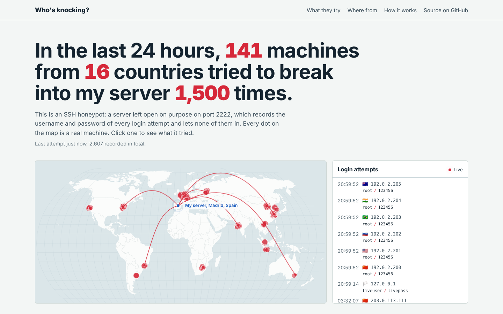
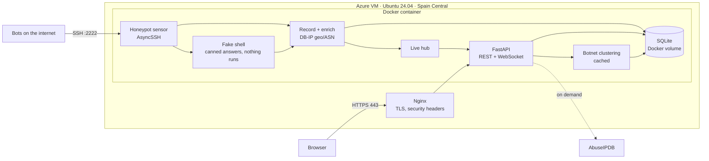
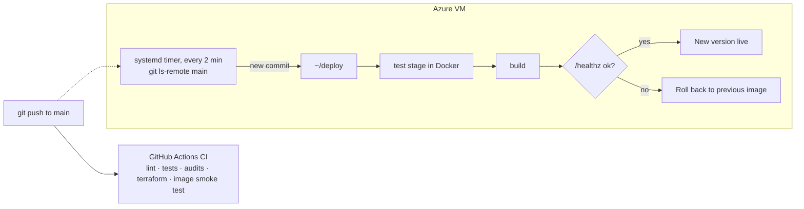

# Who's Knocking?

[](https://github.com/TrevorvaughanDEV/devops-project/actions/workflows/ci.yml)

A live SSH honeypot at **[trevorvaughan.dev](https://trevorvaughan.dev)**: a map of bots trying to break into my server, a fake shell that records what they do once they think they're in, and the botnets behind them.

Every server on the internet is scanned within minutes of going online, and bots try
default and leaked passwords against anything that answers SSH. This project leaves a
door open on purpose: an SSH **honeypot** I wrote in Python records the username and
password of every login attempt and streams each one to a world map in the browser as it
happens. The very worst passwords "work" and drop the bot into a **fake shell** that
records everything it does next, and a clustering step picks out **botnets**: hundreds of
machines working through the same password list.


<sub>Screenshot taken with demo data. The live site shows real attempts.</sub>

## What it shows

- **Live map:** an arc from the attacker's location to the server for every attempt, in real time over a WebSocket
- **Login log:** time, address, country and the exact username/password tried
- **What they try:** the most common passwords, usernames and SSH client software
- **Where from:** countries and the networks (cloud providers, ISPs) the attacks come from
- **When:** a day-by-hour heatmap of attack volume
- **What they do once they're in:** a live terminal view of every command bots send to the fake shell, the most common commands, and the malware URLs they try to download (defanged, never fetched)
- **Botnets:** machines grouped by the password list they share, with the list's distinctive passwords, countries and members
- **Attacker profiles:** click any address for its location, network, everything it tried, its shell sessions, its botnet, and its AbuseIPDB reputation
- **What the data says:** plain-English findings worked out from the past week, e.g. how many attempts go for `root`
- **Try to break in:** visitors make a real SSH login against the honeypot from the page and watch it land on the map
- **[Weekly report](https://trevorvaughan.dev/report):** a shareable summary of the week (attacks, fake-shell activity, biggest botnets), compared with the week before
- **Link previews:** `/og.png` draws a live map and 24-hour totals with Pillow, so a pasted link shows current numbers

## Architecture



The sensor, API and live feed share one asyncio event loop, so an attempt travels from the
SSH handshake to every open browser in milliseconds without a message broker.

## Why the honeypot is safe

- **Nothing an attacker types ever runs.** The "shell" is a Python class that looks each
  command up in a table of canned answers ([`shell.py`](backend/app/shell.py)). There is no
  subprocess, no real filesystem and no network access behind it. `wget` and `curl` pretend
  DNS failed, and the URL is kept as evidence.
- **Only the shell is reachable.** Port forwarding, reverse tunnels, UNIX socket forwarding,
  SFTP, SCP, subsystems, X11 and agent forwarding are all refused (tunnel attempts are
  logged). Public-key logins always fail.
- **Bounded per attacker.** Commands are cut to 1,000 characters before anything looks at
  them, output to 8 KB, packets to 16 KB. Each connection gets 3 channels, 150 commands, a
  60 s idle timeout and a hard 5-minute limit; each address gets 20 shell logins a day; and
  connection counts are capped per IP and in total. An independent review's worst-case
  inputs stall the event loop for about 5 ms.
- **Contained.** It runs as a non-root user in a container with a 400 MB memory cap.
  `/app/data` is its only writable path. It listens on 2222 inside the container, so it
  never needs root to bind a port.
- **Sanitised and defanged.** Usernames, passwords and commands are length-capped and
  stripped of control characters before storage. The frontend renders them as text, never
  HTML, and every captured URL is shown defanged (`hxxp[://]evil[.]example`).
- **Website visitors can't get in.** The "try to break in" box is always refused, whatever
  the password.
- **Real SSH stays separate.** Admin SSH is key-only on its own port, and the web app is
  bound to `127.0.0.1` behind Nginx.

The fake shell can be switched off with `SHELL_ENABLED=false`, which makes the sensor
refuse every login again.

## How botnets are found

Each attacking address is reduced to the set of username/password pairs it tried. Pairs
that addresses using three or more different SSH programs all try (`root/123456` and the
like) are dropped, because everyone tries those and they would link unrelated bots. Within
each SSH client version, two addresses are linked when they share at least 4 of the
remaining pairs, covering at least half of the smaller set. Overlap is measured against the
smaller set because botnets often hand each machine a slice of the list. Connected groups
of 3 or more are reported. Sets are bitmasks, so each comparison is one AND and a popcount;
100,000 attempts cluster in under a second, and the result is cached for 10 minutes
([`campaigns.py`](backend/app/campaigns.py)).

## Stack

| Layer | Tech |
|---|---|
| Honeypot | Python, [AsyncSSH](https://asyncssh.readthedocs.io/), persistent host keys, OpenSSH-like banner, emulated Ubuntu shell |
| API | FastAPI, REST + WebSocket, SQLite (WAL) |
| Enrichment | DB-IP Lite city and ASN databases (offline), AbuseIPDB (optional, cached) |
| Frontend | React + TypeScript + Vite, d3-geo map, no UI framework |
| Packaging | Multi-stage Docker build (Node → geo download → slim Python), non-root |
| Infrastructure | Azure VM, NSG, static IP, described in **Terraform** (`infra/terraform`) |
| Edge | Nginx, Let's Encrypt, HSTS, Content-Security-Policy |
| CI | GitHub Actions: lint, tests, dependency audits, Terraform validate, image smoke test |
| CD | Pull-based (GitOps): the server deploys new commits on `main` itself, with tests, health check and automatic rollback |

## How changes go live



**CI** ([`.github/workflows/ci.yml`](.github/workflows/ci.yml)) runs on every push and pull request:

| Job | What it does |
|---|---|
| **backend** | `ruff` lint and format, `pytest` (including real SSH logins, fake-shell sessions and hostile-input tests against the honeypot), `pip-audit` |
| **frontend** | `npm ci`, TypeScript typecheck, production build, `npm audit` |
| **terraform** | `terraform fmt -check` and `terraform validate` |
| **build** | Builds the image, then checks it boots, serves the page and API, and answers SSH with an OpenSSH banner |

**CD is pull-based**, the model behind Argo CD and Flux. A systemd timer on the server
([`scripts/autodeploy.sh`](scripts/autodeploy.sh)) checks `main` every two minutes. When it
finds a new commit, it runs [`scripts/deploy.sh`](scripts/deploy.sh):
1. Run the test suite in a Docker test stage.
2. Build the image.
3. Swap the container.
4. Wait for `/healthz`.
5. If the new version fails its health check, roll back to the previous image automatically.

Why pull instead of pushing over SSH from CI:
- **Nothing extra is exposed.** The server only makes outbound requests, and no deploy key with shell access sits in GitHub.
- **It doesn't depend on CI runners.** A busy GitHub Actions queue can't hold a release back.
- **Tests still gate every deploy,** because the server runs them itself.

## Run it locally

```bash
# Backend (API on :8000, honeypot on :2222)
cd backend
python -m venv .venv && source .venv/bin/activate
pip install -r requirements-dev.txt
DATABASE_PATH=data/demo.db python scripts/demo_data.py   # optional: fake data to look at
DATABASE_PATH=data/demo.db uvicorn app.main:app --reload

# Frontend (http://localhost:5173, proxies /api to :8000)
cd frontend && npm install && npm run dev

# Try to "break in" yourself; it'll show up live
ssh -p 2222 root@localhost          # any password is refused...
ssh -p 2222 root@localhost          # ...except a weak one like 123456: you get the fake shell
```

Tests: `cd backend && pytest -v`

## API

| Endpoint | Returns |
|---|---|
| `GET /api/summary?hours=24` | Attempts, unique IPs and countries in the window |
| `GET /api/recent?limit=50` | Latest attempts |
| `GET /api/top/{passwords,usernames,countries,orgs,clients}` | Ranked lists |
| `GET /api/map?hours=24` | One point per attacking IP with location and count |
| `GET /api/heatmap?days=30` | Attempts by weekday and hour (UTC) |
| `GET /api/ip/{ip}` | Everything one address tried, its shell sessions, its botnet and reputation |
| `GET /api/shell?days=7` | Fake-shell logins, recent sessions, top commands, download attempts |
| `GET /api/campaigns` | Botnets seen in the past 7 days |
| `WS /api/live` | Every new attempt and shell command as it happens |
| `GET /api/docs` | Interactive OpenAPI docs |

## History

Version 1 was a Flask server-monitoring dashboard on AWS EC2. It still runs at
[monitor.trevorvaughan.dev](https://monitor.trevorvaughan.dev). When the AWS free plan ended
I moved it to Azure by changing three deploy secrets, then rebuilt it as this honeypot.
Deployment notes are in [`docs/deployment.md`](docs/deployment.md).

## Credits

IP geolocation by [DB-IP](https://db-ip.com) (CC BY 4.0). Map data from Natural Earth via
`world-atlas`.

**Trevor Vaughan**, Network Engineering student at TU Dublin ·
[LinkedIn](https://www.linkedin.com/in/trevor-vaughan-1739912ab/)
