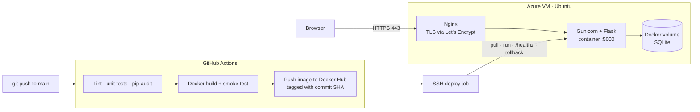

# DevOps Monitor

[](https://github.com/TrevorvaughanDEV/devops-project/actions/workflows/deploy.yml)

A server-monitoring dashboard I built and run myself at **[trevorvaughan.dev](https://trevorvaughan.dev)**.
It reports live CPU, memory and disk usage from the host, behind a login, and every push to
`main` is linted, tested, security-scanned, containerised and rolled out to a cloud VM with an
automatic rollback if the new version fails its health check.

It started on AWS EC2 and now runs on an Azure VM. Moving clouds meant changing
three secrets, because nothing in the pipeline is tied to a provider.

The app itself is deliberately small. The point of the project is everything around it:
the pipeline, the container, the server, TLS, and making deploys safe.

## Architecture



## The pipeline

[`.github/workflows/deploy.yml`](.github/workflows/deploy.yml) runs three jobs:

| Job | What it does | Why |
|---|---|---|
| **test** | `ruff` lint and format check, `pytest`, `pip-audit` on pinned dependencies | Broken or vulnerable code never reaches the image |
| **build** | Builds the image, starts it, and polls `/healthz` before pushing | Catches images that build but don't boot |
| **deploy** | Pulls the SHA-tagged image on the VM, swaps the container, waits for `/healthz`, rolls back to the previous image on failure | A bad release can't take the site down |

Pull requests run `test` and `build` only, so nothing is deployed until it is merged.

## Security decisions

- **No secret in code.** The image sets `APP_ENV=production`, and in production the app
  refuses to start without `SECRET_KEY`. The key comes from a GitHub Actions secret, or is
  generated once on the server and never leaves it.
- **Passwords** are salted and hashed with Werkzeug; queries are parameterised.
- **Session cookies** are `HttpOnly`, `SameSite=Lax` and `Secure` in production.
- **Sign-up is disabled** on the public instance (`ALLOW_SIGNUP=false`).
- **Non-root container**, with `/app/data` as its only writable path.
- **Dependencies are pinned** and scanned for known CVEs on every push.
- **Nginx** redirects HTTP to HTTPS and sets HSTS and other security headers.

## Run it locally

```bash
python -m venv .venv && source .venv/bin/activate    # Windows: .venv\Scripts\activate
pip install -r requirements-dev.txt
python app.py                                         # http://localhost:5000
```

Or with Docker:

```bash
export SECRET_KEY=$(python -c "import secrets; print(secrets.token_hex(32))")
docker compose up --build
```

## Tests

```bash
pytest -v
ruff check . && ruff format --check .
```

The tests cover the health check, the metrics API, alert thresholds, sign-up and login,
password hashing, protected routes, and that production fails fast without a secret key.

## API

| Endpoint | Auth | Returns |
|---|---|---|
| `GET /healthz` | – | `{"status": "ok"}`, used by Docker and the deploy job |
| `GET /api/system_info?server=server1` | – | CPU, memory, disk, recent history and alerts |
| `GET /api/visits` | – | Total page visits |

## Project layout

```
app.py                  Flask app
templates/              Dashboard pages
tests/                  Unit tests
Dockerfile              Production image (Gunicorn, non-root, health check)
docker-compose.yml      Local run
.github/workflows/      CI/CD pipeline
docs/deployment.md      Server setup, secrets, backups
docs/nginx.conf         Reverse proxy and TLS config
```

## What's next

- [ ] Provision the VM, network security group and DNS with **Terraform** instead of by hand
- [ ] Ship metrics to **Prometheus** and graph them in **Grafana**
- [ ] A lightweight agent so the dashboard can watch more than one real server
- [ ] Move from SQLite to a managed **PostgreSQL** database
- [ ] Container image scanning with Trivy

## Author

**Trevor Vaughan**, Networking Technology student at TU Dublin, working towards cloud,
DevOps and security engineering. [trevorvaughan.dev](https://trevorvaughan.dev)
